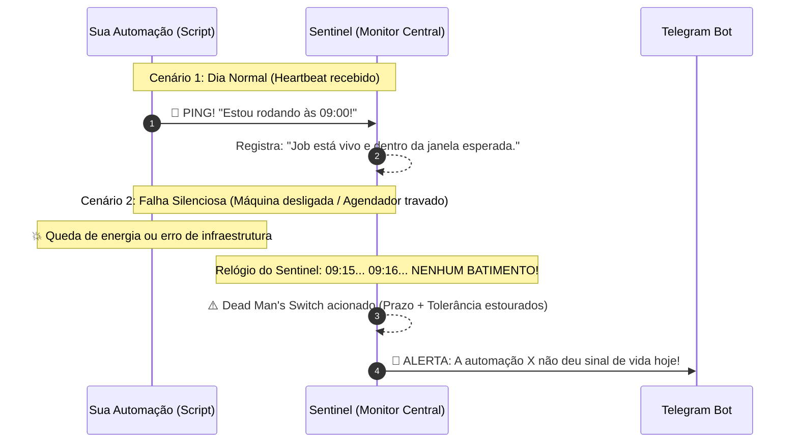

# 🛡️ Sentinel — Centralizador de Notificações e Monitoramento de Automações

**Documentação Técnica, Arquitetura e Manual Operacional**  
*Versão 1.5 - 29 de setembro de 2026*

---

## 1. Visão Geral

O **Sentinel** é um sistema centralizador, leve e autônomo, desenvolvido em Python para monitorar a saúde de tarefas agendadas, rotinas batch e robôs de automação corporativos.

### 1.1 O Problema que Resolve
No desenvolvimento de automações, o maior desafio de confiabilidade não é capturar quando um script falha, mas sim **descobrir quando o script sequer executou** (por máquina desligada, falha no agendador de tarefas do Windows, falta de energia ou travamento do sistema operacional).
> *"Um script que não roda não consegue enviar uma mensagem avisando que não rodou."*

O Sentinel resolve essa dor com duas abordagens complementares:
1. **Notificação Ativa de Erro (Push):** Intercepta exceções em tempo de execução e dispara alertas imediatos com duração e *traceback* completo da falha.
2. **Dead Man's Switch (Monitor de Ausência / Heartbeat):** Um serviço vigia contínuo que aguarda o sinal de vida do script dentro do horário e tolerância previstos. Se o sinal não chegar, o Sentinel assume a responsabilidade de soar o alarme.

Além dos alertas, o sistema fornece consulta operacional pelo Telegram, relatórios automáticos agendados, suporte a janelas e dias da semana e um dashboard em tela cheia para administrar grande volume de sub-rotinas.

---

## 2. O Conceito de Heartbeat e a Falha Silenciosa

### 2.1 O que é Heartbeat?
**Heartbeat** (em tradução literal, **"batimento cardíaco"**) é um padrão essencial na engenharia de software para aferir se um sistema está **vivo, saudável e ativo**.

A melhor analogia é o **monitor cardíaco de um hospital**:
* Enquanto o paciente está vivo, o aparelho emite batimentos regulares: *bip... bip... bip...*
* O médico não precisa perguntar a todo momento se o paciente está vivo: o batimento contínuo atesta a saúde.
* Se o coração parar de bater por alguns segundos (silêncio), o monitor não recebe mais nenhum impulso e dispara a sirene de emergência: **🚨 PIIIIIIIIII!**



### 2.2 Por que arquivos de log tradicionais são insuficientes?
Sem a lógica de Heartbeat, você depende exclusivamente de o script rodar com sucesso até o fim ou entrar em um bloco `try/except` para gravar em arquivo de log. No entanto, em casos de **falha silenciosa**:
* O computador foi desligado à noite ou reiniciado por atualização do Windows;
* A máquina perdeu a conexão de rede;
* O Agendador de Tarefas do Windows falhou em disparar o executável;
* Houve uma falha de falta de memória (OOM) antes mesmo de o interpretador Python carregar o seu script.

Nesses cenários, **o script sequer chegou a iniciar**. Ele não gerou logs, não enviou e-mails e não alertou ninguém.

> Com o **Heartbeat do Sentinel**, a lógica se inverte: **a ausência de sinal é uma má notícia**. Se o script não provar que executou dentro do horário previsto, o Sentinel assume a iniciativa e dispara o alerta.

---

## 3. Arquitetura e Stack de Tecnologias

```
+-------------------------------------------------------------------------+
|                         SUAS AUTOMAÇÕES                                |
|  [Crypt_Lamina]              [Slipagem_NetFactor]        [Outros Scripts] |
+--------+------------------------------+-------------------------+-------+
         |                              |                         |
         +--------------------+---------+-------------------------+
                              | (Pings: /start, /success, /fail)
                              v
+-------------------------------------------------------------------------+
|                     SENTINEL CENTRAL MONITOR (Porta 8050)              |
|                                                                         |
|  +---------------------+      +--------------------------------------+  |
|  |   FastAPI Backend   | ---> |        SQLite (sentinel.db)          |  |
|  |  (Rotas REST e UI)  |      | (jobs, job_executions, telegram...) |  |
|  +---------------------+      +-------------------+------------------+  |
|             ^                                     ^                     |
|             |                                     | Inspeciona prazos   |
|  +----------+----------+      +-------------------+------------------+  |
|  |   Dashboard Web     |      |         APScheduler Worker           |  |
|  | (http://...:8050)   |      |   (Verifica ausências a cada 15s)    |  |
|  +---------------------+      +-------------------+------------------+  |
+---------------------------------------------------|---------------------+
                                                    | Dispara alertas
                                                    v
                                  +------------------------------------+
                                  |       CANAL DE NOTIFICAÇÃO         |
                                  |    • Telegram Bot (Mensagens HTML) |
                                  |    • Console / Terminal            |
                                  +------------------------------------+
```

### 3.1 Componentes Principais
* **FastAPI:** Servidor assíncrono de altíssima performance responsável por receber os pings, expor a documentação interativa e servir o painel web.
* **SQLite:** Banco de dados relacional de arquivo único (`sentinel.db`). Não requer instalação de servidor adicional, Docker ou configuração de usuários.
* **APScheduler:** Motor de segundo plano que inspeciona o Dead Man's Switch, consulta comandos do Telegram e entrega relatórios automáticos agendados.
* **Telegram Bot API:** Entrega alertas, responde consultas de status/histórico e cadastra relatórios programados. Apenas o `TELEGRAM_CHAT_ID` autorizado pode executar comandos.
* **Dashboard Web:** Interface responsiva em `100vw × 100vh`, com indicadores laterais, visualização em cards/lista, expansão individual/coletiva, ordenação por criticidade e histórico com modal de *traceback*.
* **MCP App (`mcp-app/`):** servidor Node.js com transporte Streamable HTTP em `/mcp`, ferramentas somente leitura e componente visual compatível com o padrão MCP Apps.
* **Cliente Python (`client/monitor.py`):** Decorador `@monitor_job` construído exclusivamente com a biblioteca padrão do Python (`urllib`).
* **Cliente PHP (`client/sentinel_monitor.php`):** Wrapper `sentinel_monitor(...)` sem dependências externas, com captura de exceções, erros fatais, duração e encerramentos prematuros.
* **Identificação de linguagem:** o ping inicial informa automaticamente `python` ou `php`; o dashboard apresenta ícones próprios para Python, PHP e arquivos BAT.

### 3.2 Persistência no SQLite

O arquivo `sentinel.db` contém três tabelas principais:

| Tabela | Finalidade |
| :--- | :--- |
| `jobs` | Cadastro, linguagem, cron/intervalo, janela, dias, tolerância, estado atual e próxima execução. |
| `job_executions` | Histórico de início, fim, duração, status, mensagem de erro e traceback. |
| `telegram_report_schedules` | Relatórios automáticos do Telegram, incluindo horário, dias, tipo, job, limite e último envio. |

As migrações são idempotentes e executadas por `init_db()` na inicialização. Bancos existentes recebem novas colunas e tabelas sem excluir jobs ou históricos.

---

## 4. Funcionamento Detalhado da Função Decoradora (`@monitor_job`)

### 4.1 O que é um Decorador em Python?
Um decorador (*decorator*) funciona como uma **"capa protetora"** ou um **"vigia"** colocado em volta de uma função sem alterar uma única linha da regra de negócio que está dentro dela.

Quando você aplica:
```python
@monitor_job(job_id="Crypt_Lamina", name="Processamento de PDFs")
def main():
    ...
```

Você instrui o interpretador Python:
> *"Não execute a função `main()` diretamente. Entregue-a primeiro para o `monitor_job`. Ele deve vigiar tudo o que acontece antes, durante e depois da execução."*

### 4.2 Anatomia das 3 Camadas Internas
Para permitir a passagem de parâmetros (`job_id`, `name`) e envolver a função original, o decorador adota a arquitetura clássica de 3 camadas em [`client/monitor.py`](../client/monitor.py):

```python
def monitor_job(job_id: str, name: Optional[str] = None, server_url: str = DEFAULT_SERVER_URL, timeout: float = 5.0):
    # CAMADA 1: Recebe os parâmetros de configuração (@monitor_job(job_id=...))
    
    def decorator(func: Callable[..., Any]) -> Callable[..., Any]:
        # CAMADA 2: Recebe a função original que foi decorada (ex: def main)
        
        @functools.wraps(func)
        def wrapper(*args, **kwargs) -> Any:
            # CAMADA 3: O "dublê" que executa no lugar da função original
            with SentinelMonitor(
                job_id=job_id,
                name=name or func.__name__,
                server_url=server_url,
                timeout=timeout
            ):
                return func(*args, **kwargs)
        return wrapper
    return decorator
```

### 4.3 O Context Manager `SentinelMonitor` (`__enter__` e `__exit__`)
A real orquestração acontece nos métodos mágicos do contexto:

1. **`__enter__` (Antes da Execução):**
   * Dispara o cronômetro com `time.time()`.
   * Envia um HTTP POST para `/api/ping/{job_id}/start`.
   * O Sentinel muda o status no dashboard para ⏳ **Executando** e armazena o `execution_id`.

2. **Execução da sua Função:**
   * O seu código roda de ponta a ponta normalmente.

3. **`__exit__` (Ao Concluir ou Falhar):**
   * **Se executou com sucesso (`exc_type is None`):**
     * Calcula o tempo total transcorrido (`duration_seconds`).
     * Envia um HTTP POST para `/api/ping/{job_id}/success`.
     * O Sentinel marca como 🟢 **OK** e recalcula a próxima data esperada.
   * **Se ocorreu uma exceção (`exc_type is not None`):**
     * Captura o erro e extrai o *traceback* completo via `traceback.format_exception`.
     * Envia um HTTP POST para `/api/ping/{job_id}/fail` com o erro e a pilha de execução.
     * O Sentinel envia o alerta imediato no Telegram com a linha exata da falha.
     * **Relança a exceção:** O método retorna `False`, forçando o Python a manter o erro original sem mascarar comportamentos da aplicação.

### 4.4 Isolamento de Falhas do Monitor
Se o servidor do Sentinel estiver temporariamente desligado ou a rede local oscilar, o decorador captura internamente a falha de conexão HTTP e apenas exibe um aviso suave no terminal (`[Sentinel Monitor Warning]`). **O script da sua automação nunca quebra nem para de rodar por causa do monitor.**

---

## 5. Estrutura de Diretórios e Arquivos

```
automation-sentinel/
├── .env                        # Credenciais ativas (Token Telegram, Chat ID, Porta)
├── .env.example                # Modelo de configuração de ambiente
├── requirements.txt            # Dependências do servidor central
├── run.bat                     # Atalho de 1 clique para inicialização no Windows
├── run_mcp.bat                 # Inicializa o servidor MCP App
├── sentinel.db                 # Banco SQLite (criado automaticamente)
│
├── app/
│   ├── config.py               # Leitura de variáveis e caminhos
│   ├── database.py             # Modelagem relacional e operações SQL
│   ├── notifier.py             # Formatador de templates e envio Telegram/Console
│   ├── telegram_bot.py          # Comandos e relatórios agendados do Telegram
│   ├── scheduler.py             # Dead Man's Switch, polling e relatórios
│   ├── main.py                 # Rotas da API FastAPI e ciclo de vida
│   └── templates/
│       └── dashboard.html      # Interface web do painel
│
├── client/
│   ├── __init__.py
│   ├── monitor.py              # SDK leve do cliente Python (@monitor_job)
│   └── sentinel_monitor.php    # Cliente PHP
│
├── mcp-app/
│   ├── package.json            # Dependências, testes e comandos Node.js
│   ├── server.mjs              # Ferramentas MCP e transporte HTTP
│   ├── public/
│   │   └── sentinel-widget.html # Componente visual MCP Apps
│   └── test/
│       └── server.test.mjs     # Teste de protocolo com cliente MCP real
│
├── docs/                       # Documentação nos formatos MD, HTML e PDF
│   ├── DOCUMENTACAO.md
│   ├── DOCUMENTACAO.html
│   ├── DOCUMENTACAO.pdf
│   └── build_pdf.py            # Gerador automatizado do PDF
│
└── tests/
    ├── test_execution_window.py
    ├── test_language_metadata.py
    ├── test_telegram_bot.py
    └── test_simulation.py
```

---

## 6. Guia de Instalação e Execução

### 6.1 Instalação das Dependências
No computador que hospedará o servidor do Sentinel:
```powershell
cd "C:\Automações\automation-sentinel"
pip install -r requirements.txt
```

### 6.2 Executando o Servidor

#### Opção 1: Duplo clique no `run.bat` (Recomendado)
Basta dar um duplo clique no arquivo `run.bat`. Ele abrirá o terminal e iniciará o serviço com suporte a reinicialização automática.

#### Opção 2: Pelo Terminal
```powershell
python -m uvicorn app.main:app --host 127.0.0.1 --port 8050 --reload
```

Acesse no navegador:
* **Painel de Controle:** `http://127.0.0.1:8050`
* **Swagger API Docs:** `http://127.0.0.1:8050/docs`

### 6.3 MCP App para ChatGPT e Codex

O diretório `mcp-app/` contém um servidor MCP separado que consulta as rotas REST do Sentinel. A versão 0.1 é somente leitura e não cadastra, edita, remove ou envia pings em nome das automações.

```powershell
cd "C:\Automações\automation-sentinel\mcp-app"
npm.cmd install
npm.cmd start
```

O atalho `run_mcp.bat` executa o mesmo servidor. Por padrão, o endpoint fica em `http://127.0.0.1:8787/mcp` e consulta `http://127.0.0.1:8050`. Os valores podem ser alterados no `.env` com `MCP_HOST`, `MCP_PORT` e `SENTINEL_API_URL`.

O MCP App expõe três ferramentas:

* `sentinel_list_jobs`: lista os jobs e resume quantos estão saudáveis, executando, com falha, ausentes ou aguardando;
* `sentinel_get_executions`: retorna o histórico recente e os diagnósticos completos de falha;
* `sentinel_render_status`: associa os dados atuais ao recurso visual `ui://sentinel/status/v1.html`.

O componente usa a ponte padrão MCP Apps (`ui/initialize`, `ui/notifications/tool-result` e `tools/call`) e continua funcional como ferramenta estruturada em clientes que não renderizam UI. Para acesso remoto, publique somente por HTTPS e adicione autenticação e controle de acesso antes de expor dados operacionais.

Execute `npm.cmd test` dentro de `mcp-app/` para validar o transporte Streamable HTTP com um cliente MCP real.

---

## 7. Como Integrar nas Suas Automações

### 7.1 O arquivo `monitor.py`
Copie o arquivo `client/monitor.py` para dentro da pasta da sua automação.

### 7.2 Uso com Decorador `@monitor_job`
```python
from monitor import monitor_job

@monitor_job(job_id="meu_job_id", name="Nome Amigável da Automação")
def minha_funcao_principal():
    print("Processando dados...")
    processar()

if __name__ == "__main__":
    minha_funcao_principal()
```

### 7.3 Regra Crucial do `try/except`
Se o seu código possui um bloco `try/except Exception as e:` onde você grava em arquivos de log próprios, **você deve relançar a exceção (`raise e`)** ao final do bloco:

```python
@monitor_job(job_id="minha_tarefa", name="Minha Tarefa")
def main():
    try:
        processar()
    except Exception as e:
        logger.error("Falha na execução", exc_info=e)
        raise e  # <- OBRIGATÓRIO para notificação no Sentinel
```

### 7.4 Integração com PHP

Coloque `sentinel_monitor.php` em uma pasta compartilhada do sistema PHP e importe-o nos scripts monitorados. Quando o cliente e a rotina estiverem na mesma pasta:

```php
<?php
require_once __DIR__ . '/sentinel_monitor.php';

function executarMonitoramento()
{
    // Fluxo principal da automação.
}

sentinel_monitor(
    'monitoramento_nf_email',
    'Monitoramento de notas fiscais por e-mail',
    'executarMonitoramento'
);
```

Em código legado, substitua `die($mensagem)` por `sentinel_fail($mensagem)` para que o alerta preserve a mensagem e o stack trace. Quando um `exit` representar uma conclusão normal, substitua-o por `return`.

### 7.5 Ícones de linguagem no dashboard

O cliente Python envia `language: "python"` e o cliente PHP envia `language: "php"` no endpoint de início. O backend persiste esse metadado no cadastro do job e o dashboard mostra:

* o logotipo do Python para rotinas Python;
* o ícone oficial do PHP para rotinas PHP;
* o ícone do Windows para arquivos BAT cadastrados como **Outra / BAT**;
* um ícone de interrogação específico quando a linguagem é desconhecida ou ainda não foi identificada.

Jobs antigos são atualizados automaticamente na próxima execução com o cliente mais recente. Cópias externas de `sentinel_monitor.php` precisam ser substituídas após a atualização do Sentinel.

No cadastro ou na edição manual do dashboard, o operador também pode selecionar **Python**, **PHP** ou **Outra / BAT**. O valor é enviado no campo `language` de `POST /api/jobs`. Quando um cliente posteriormente envia sua própria linguagem no ping de início, esse dado automático passa a representar a execução atual.

### 7.6 Scripts PHP com vários ciclos HTTP

Rotinas longas podem dividir o trabalho em diversas requisições por redirecionamento. Nesses casos:

* envolva o laço principal em uma função monitorada;
* depois de emitir o redirecionamento, use `return` para concluir o ciclo atual com sucesso;
* não use `exit`, pois ele representa encerramento prematuro para o cliente;
* relance exceções capturadas nos lotes para registrar a falha e seu stack trace;
* use `sentinel_fail(...)` quando a fila parar de avançar ou atingir o limite de ciclos.

O exemplo completo está em `examples/php/analise_nfs_com_sentinel.php`, usando o job ID `Analise_NFs`.

### 7.7 Retorno bancário Grafeno

O exemplo `examples/php/retorno_bancario_grafeno_com_sentinel.php` usa o job ID `Retorno_Bancario_Grafeno` e considera `sentinel_monitor.php` na pasta imediatamente anterior:

```php
require_once __DIR__ . '/../sentinel_monitor.php';
```

O fluxo diferencia:

* falha de API, banco, download, log ou cópia: `sentinel_fail(...)`;
* troca de empresa ou próxima página: gera o redirecionamento e usa `return`;
* fim de todas as páginas e empresas: retorna normalmente e registra sucesso.

Por segurança, os alertas armazenam apenas uma descrição resumida. Headers HTTP, o campo `Authorization` e o token Grafeno não devem ser enviados ao Sentinel ou ao Telegram.

### 7.8 Janelas de execução e dias da semana

Jobs baseados em intervalo podem limitar o monitoramento a uma janela diária e a dias específicos. Os campos persistidos são:

* `expected_interval_minutes`: intervalo entre execuções;
* `execution_window_start`: início em `HH:MM`;
* `execution_window_end`: fim exclusivo em `HH:MM`;
* `execution_weekdays`: dias ISO separados por vírgula (`1=segunda`, `7=domingo`);
* `grace_period_minutes`: tolerância depois do horário esperado.

Exemplo equivalente a “segunda a sexta, iniciar às 09:00, repetir a cada 1 hora durante 3 horas”:

```text
Intervalo: 60
Início: 09:00
Fim: 12:00
Dias: 1,2,3,4,5
```

O fim é exclusivo: as ocorrências esperadas são 09:00, 10:00 e 11:00. Depois das 12:00, a próxima expectativa é 09:00 do próximo dia permitido. Na sexta-feira, a próxima expectativa passa para segunda-feira. Isso impede falsos positivos durante a noite e no final de semana.

Quando `schedule_cron` estiver preenchido, o Cron tem prioridade. Para uma única execução às 09:00 de segunda a sexta:

```cron
0 9 * * 1-5
```

### 7.9 Integração de arquivos BAT

Um BAT pode usar `curl.exe` para consumir os mesmos endpoints dos clientes Python e PHP:

```bat
@echo off
setlocal
set "SENTINEL_URL=http://127.0.0.1:8050"
set "JOB_ID=minha_rotina_bat"

curl.exe -s -X POST "%SENTINEL_URL%/api/ping/%JOB_ID%/start" ^
  -H "Content-Type: application/json" ^
  -d "{\"job_name\":\"Minha rotina BAT\",\"language\":\"other\"}" >nul 2>&1

call "C:\Automacoes\rotina_original.bat"
set "EXIT_CODE=%ERRORLEVEL%"

if "%EXIT_CODE%"=="0" goto sucesso
curl.exe -s -X POST "%SENTINEL_URL%/api/ping/%JOB_ID%/fail" ^
  -H "Content-Type: application/json" ^
  -d "{\"error_message\":\"BAT finalizado com codigo %EXIT_CODE%\"}" >nul 2>&1
goto fim

:sucesso
curl.exe -s -X POST "%SENTINEL_URL%/api/ping/%JOB_ID%/success" ^
  -H "Content-Type: application/json" -d "{}" >nul 2>&1

:fim
endlocal & exit /b %EXIT_CODE%
```

O `JOB_ID` deve coincidir com o painel. Processos abertos com `start` devem usar `start /wait`. Um `pause` incondicional não deve ser utilizado em tarefas automáticas, pois impede o encerramento do processo.

---

## 8. Configuração do Bot do Telegram

Para que as notificações cheguem no seu celular:

1. **Criar o Bot:**
   * Abra o Telegram e pesquise por `@BotFather`.
   * Envie o comando `/newbot` e defina um nome e um username terminado em `bot`.
   * Copie o **Token de Acesso HTTP** gerado.

2. **Obter seu Chat ID:**
   * Inicie uma conversa com seu novo bot e envie uma mensagem qualquer.
   * Pesquise por `@userinfobot` no Telegram e inicie a conversa. Ele responderá com o seu número de identificação (`Id`).

3. **Preencher o arquivo `.env`:**
   Abra o arquivo `.env` do Sentinel e configure:
   ```ini
   TELEGRAM_BOT_TOKEN=123456789:ABCdefGHIjklMNOpqrSTUvwxYZ
   TELEGRAM_CHAT_ID=987654321
   TELEGRAM_COMMANDS_ENABLED=true
   TELEGRAM_POLL_INTERVAL_SECONDS=5
   TELEGRAM_HISTORY_LIMIT=5
   CONSOLE_ALERTS=true
   ```

### 8.1 Consultas pelo Telegram

O bot usa `getUpdates` em segundo plano e aceita comandos somente do `TELEGRAM_CHAT_ID` configurado:

| Comando | Resultado |
| :--- | :--- |
| `/status` | Resumo e situação de todas as automações. |
| `/ultimas job_id` | Últimas cinco execuções do job. |
| `/ultimas job_id 10` | Histórico com quantidade entre 1 e 20. |
| `/automacoes` | Lista nomes e IDs disponíveis. |
| `/ajuda` | Ajuda incorporada ao bot. |

As respostas escapam conteúdo HTML de nomes e mensagens de erro. Listagens extensas de status são divididas para respeitar o limite de mensagem do Telegram.

### 8.2 Relatórios automáticos pelo Telegram

Os relatórios são persistidos em `telegram_report_schedules` e sobrevivem a reinicializações:

```text
/agendar status 09:00 1-5
/agendar ultimas Crypt_Lamina 18:00 1-5 5
/agendamentos
/cancelar_agendamento 3
```

O primeiro exemplo envia o status geral às 09:00 de segunda a sexta. O segundo envia cinco execuções do job `Crypt_Lamina` às 18:00. Os dias aceitam `1-5`, listas como `1,3,5`, `todos` ou `diasuteis`. A coluna `last_sent_on` impede duplicidade no mesmo dia.

### 8.3 Dashboard operacional

O dashboard foi projetado para grande quantidade de sub-rotinas:

* ocupa `100vw × 100vh`, mantendo rolagem dentro das áreas de conteúdo;
* empilha os indicadores Total, Saudáveis, Executando, Com Falha e Ausentes na lateral esquerda;
* mantém o menu Automações / Últimas execuções na barra superior;
* oferece modos **Cards** e **Lista**, persistidos no `localStorage`;
* inicia os cards minimizados e permite expandir um ou todos;
* mostra status e próxima execução no card minimizado; ao expandir, a linha compacta da próxima execução é ocultada para evitar duplicidade;
* ao expandir, exibe linguagem, frequência, janela, dias, tolerância, última execução, próxima execução e limite máximo;
* ordena por criticidade: `FAILED`/`TIMEOUT`, `MISSED`, `RUNNING`, `SUCCESS`, `PENDING`;
* mantém filtro de automações, filtro de histórico e atalho direto do card para suas execuções;
* abre os erros do histórico em um modal seguro, com identificação da automação, status, horário, mensagem completa, traceback e ação para copiar o diagnóstico;
* consulta até 100 execuções para o histórico da interface.

---

## 9. Referência dos Endpoints da API

| Método | Rota | Descrição |
| :--- | :--- | :--- |
| `GET` | `/` | Interface gráfica do Dashboard |
| `GET` | `/api/jobs` | Lista todas as automações cadastradas e seus status |
| `POST` | `/api/jobs` | Cadastra ou atualiza nome, linguagem, cron/intervalo, janela, dias, tolerância e timeout |
| `DELETE`| `/api/jobs/{job_id}` | Exclui uma automação e seu histórico de execuções |
| `POST` | `/api/ping/{job_id}/start` | Registra o início e recebe `job_name` e `language` (`python`, `php` ou `other`) |
| `POST` | `/api/ping/{job_id}/success` | Registra conclusão com sucesso e tempo de execução |
| `POST` | `/api/ping/{job_id}/fail` | Registra falha e dispara notificação com o *traceback* |
| `GET` | `/api/executions?limit=100&job_id=...` | Histórico com limite e filtro opcionais |
| `POST` | `/api/test-telegram` | Dispara mensagem de teste para validar o token do Telegram |

---

## 10. Automações Ativas Monitoradas

1. **`Crypt_Lamina`**
   * **Caminho:** `C:\Automações\crypt_lamina\main.py`
   * **Propósito:** Processamento e criptografia de arquivos PDF da lâmina.
   * **Status:** Integrado com `@monitor_job(job_id="Crypt_Lamina", ...)` e validado com sucesso.

2. **`Slipagem_NetFactor`**
   * **Caminho:** `C:\Automações\slipagem\main.py`
   * **Propósito:** Orquestração de exportação contábil e congelamento no banco de dados.
   * **Status:** Integrado com `@monitor_job(job_id="Slipagem_NetFactor", ...)`.
